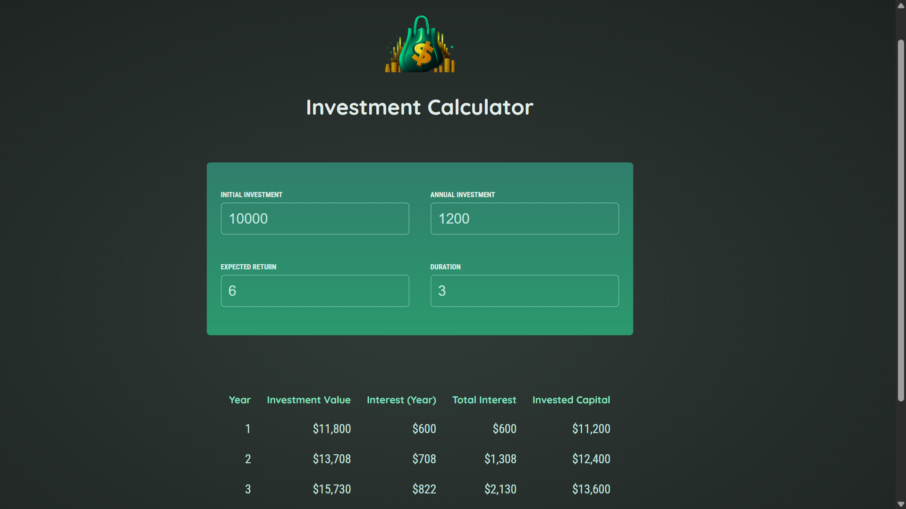

# Investment Calculator

A modern web application for calculating investment growth over time. Built with React, TypeScript, and Vite.

## 🚀 Live Demo

**[View Live Demo](https://investment-calculator-six-lovat.vercel.app/)**



## Features

- **Dynamic Investment Calculations**: Input your initial investment, annual contributions, expected return rate, and investment duration
- **Real-time Results**: View detailed year-by-year investment growth calculations
- **Input Validation**: Ensures valid investment parameters before displaying results
- **Responsive Design**: Clean and intuitive user interface
- **Type-Safe**: Fully typed with TypeScript for robust development

## Getting Started

### Prerequisites

- Node.js 18+
- npm or yarn

### Installation

1. Install dependencies:

```bash
npm install
```

### Development

Start the development server with hot module reloading:

```bash
npm run dev
```

The application will be available at `http://localhost:5173`

### Build

Build for production:

```bash
npm run build
```

### Lint

Check code quality:

```bash
npm lint
```

### Preview

Preview the production build locally:

```bash
npm run preview
```

## Project Structure

```
src/
├── components/        # React components
│   ├── Header.tsx    # Application header
│   ├── UserInput.tsx # Investment input form
│   ├── Results.tsx   # Investment results display
│   ├── types.ts      # TypeScript type definitions
│   └── index.tsx     # Component exports
├── utils/
│   └── investment.tsx # Investment calculation logic
├── App.tsx           # Main application component
└── main.tsx          # Application entry point
```

## How It Works

1. **User Input**: Enter your initial investment amount, annual investment contribution, expected annual return rate (%), and investment duration (years)
2. **Calculation**: The app calculates year-by-year investment growth based on compound interest
3. **Results**: View a detailed breakdown of each year's performance including interest earned and total value

## Technology Stack

- **React 19** - UI library
- **TypeScript** - Type-safe JavaScript
- **Vite** - Fast build tool and dev server
- **ESLint** - Code quality and style checking

## License

MIT
